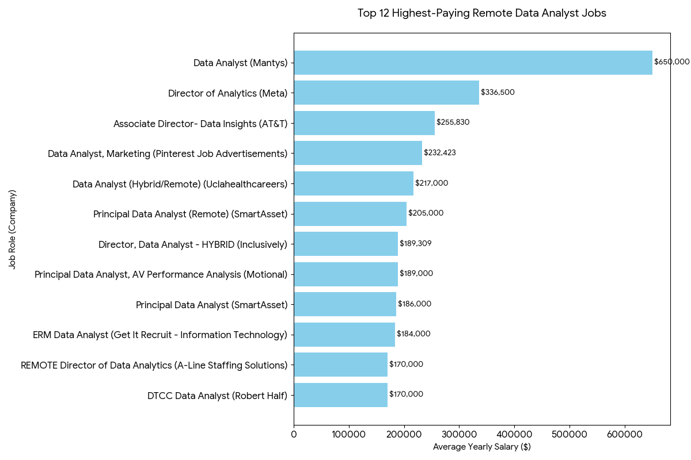
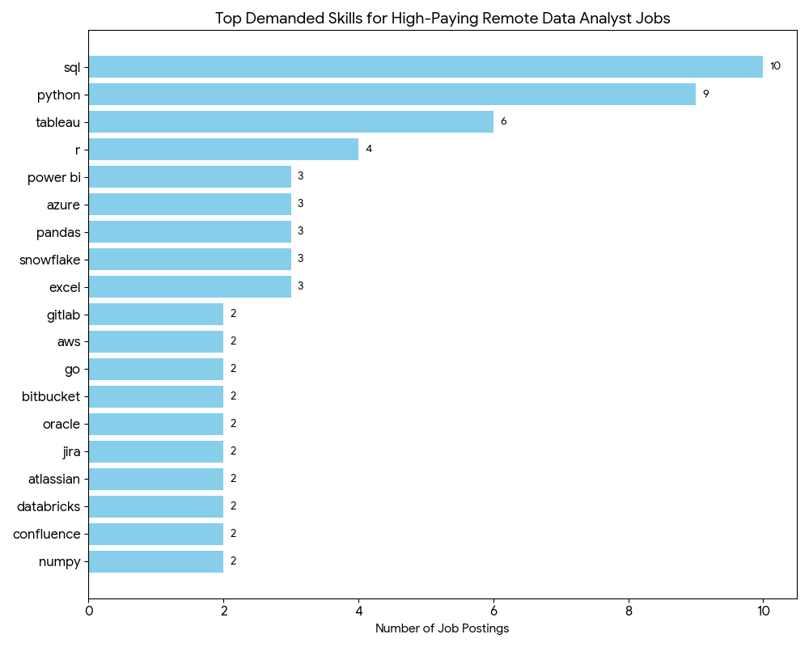

# Introduction
Welcome to my SQL Portfolio Project, where I analyze the data job market with a focus on Data Analyst roles. In this project, I explore top-paying remote jobs, identify the most in-demand skills, and examine which skills offer both high demand and strong salaries. Through structured SQL analysis, I aim to understand how data professionals can strategically position themselves in today’s market.

Check out my SQL queries here: [project folder](/project/).
# Background
The motivation behind this project was my desire to better understand the Data Analyst job market through real data rather than assumptions. I wanted to analyze which roles offer the highest salaries, which skills are most in demand, and how demand and salary intersect to guide a more strategic learning path.

The dataset used in this analysis comes from Luke Barousse’s SQL Course (link to be added) and includes information on job titles, salaries, locations, remote status, and required skills.

As my first end-to-end SQL portfolio project, this work represents an important milestone in my journey, shifting my focus from learning SQL syntax to applying it for real-world market analysis.
# Tools I Used
In this project, I utilized a variety of tools to conduct my analysis:

- **SQL** (Structured Query Language): Enabled me to interact with the database, extract insights, and answer my key questions through queries.
- **PostgreSQL**: As the database management system, PostgreSQL allowed me to store, query, and manipulate the job posting data.
- **Visual Studio Code:** This open-source administration and development platform helped me manage the database and execute SQL queries.

# The Analysis
Each query focuses on a specific dimension of the Data Analyst job market. Here’s how I approached each question.
1. Top Paying Data Analyst Jobs
To identify the highest-paying Data Analyst roles, I filtered remote positions with specified annual salaries and sorted them in descending order. This allowed me to highlight the top 12 highest-paying opportunities and observe how salary levels relate to seniority and company profile.

```sql
SELECT
    job_id,
    job_title,
    job_location,
    job_schedule_type,
    salary_year_avg,
    job_posted_date,
    name AS company_name,
    job_country
FROM    
    job_postings_fact
LEFT JOIN company_dim ON job_postings_fact.company_id = company_dim.company_id
WHERE
    job_title_short = 'Data Analyst' AND
    job_location = 'Anywhere' AND 
    salary_year_avg IS NOT NULL 
ORDER BY
    salary_year_avg DESC
LIMIT 12
```

Bar graph visualizing the salary for the top 12 salaries for data analysts; Gemini generated this graph from my SQL query results


2. Skills for Top Paying Jobs
To identify the skills behind the highest-paying roles, I combined job postings with the related skills data. This allowed me to understand what employers value most in high-salary Data Analyst positions.

```sql
WITH top_paying_jobs AS (
SELECT
    job_id,
    job_title,
    salary_year_avg,
    job_posted_date,
    name AS company_name
FROM    
    job_postings_fact
LEFT JOIN company_dim ON job_postings_fact.company_id = company_dim.company_id
WHERE
    job_title_short = 'Data Analyst' AND
    job_location = 'Anywhere' AND 
    salary_year_avg IS NOT NULL 
ORDER BY
    salary_year_avg DESC
LIMIT 12
)

SELECT
    top_paying_jobs.*,
    skills
FROM top_paying_jobs
INNER JOIN skills_job_dim ON top_paying_jobs.job_id = skills_job_dim.job_id
INNER JOIN skills_dim ON skills_job_dim.skill_id = skills_dim.skill_id
ORDER BY
    salary_year_avg DESC
```


Bar graph visualizing the count of skills for the top 12 paying jobs for data analysts; Gemini generated this graph from my SQL query results

3. In-Demand Skills for Data Analysts
This analysis revealed the most in-demand skills for Data Analysts, helping me understand where I should focus my learning.

```sql
SELECT
    skills,
    COUNT(skills_job_dim.job_id)AS demand_count
FROM job_postings_fact
INNER JOIN skills_job_dim ON job_postings_fact.job_id = skills_job_dim.job_id
INNER JOIN skills_dim ON skills_job_dim.skill_id = skills_dim.skill_id
WHERE
    job_title_short = 'Data Analyst' AND
    job_work_from_home = TRUE
GROUP BY
    skills
ORDER BY
    demand_count DESC
LIMIT 5
```
### 📊 Most Demanded Skills
| Skills | Demand Count |
| :--- | :--- |
| **SQL** | 7,291 |
| **Excel** | 4,611 |
| **Python** | 4,330 |
| **Tableau** | 3,745 |
| **Power BI** | 2,609 |

Table of the demand for the top 5 skills in data analyst job postings

4. Skills Based on Salary
This query showed which skills are connected to higher average salaries in the Data Analyst market.

```sql
SELECT
    skills,
  ROUND(AVG(salary_year_avg), 0) AS avg_salary
FROM job_postings_fact
INNER JOIN skills_job_dim ON job_postings_fact.job_id = skills_job_dim.job_id
INNER JOIN skills_dim ON skills_job_dim.skill_id = skills_dim.skill_id
WHERE
    job_title_short = 'Data Analyst' 
    AND salary_year_avg IS NOT NULL 
    AND job_work_from_home = True
GROUP BY
    skills
ORDER BY
    avg_salary DESC
LIMIT 25
```
### 💰 Highest Paying Skills
| Skills | Average Salary ($) |
| :--- | :--- |
| **PySpark** | 208,172 |
| **Bitbucket** | 189,155 |
| **Couchbase** | 160,515 |
| **Watson** | 160,515 |
| **DataRobot** | 155,486 |
| **GitLab** | 154,500 |
| **Swift** | 153,750 |
| **Jupyter** | 152,777 |
| **Pandas** | 151,821 |
| **Elasticsearch** | 145,000 |
| **Golang** | 145,000 |

📊 Results Breakdown

The table shows that more technical and specialized skills are linked to higher salaries.

PySpark has the highest average salary ($208K), highlighting the value of big data skills.

Tools like Bitbucket, Couchbase, and DataRobot also rank high, suggesting demand for engineering-related knowledge.

Programming tools such as Pandas, Jupyter, Swift, and Golang are associated with strong salary outcomes.

5. Most Optimal Skills to Learn
This analysis combines demand and salary insights to highlight the most valuable skills to focus on as a Data Analyst.

```sql
WITH skills_demand AS (
    SELECT
        skills_dim.skill_id,
        skills_dim.skills,
        COUNT(skills_job_dim.job_id) AS demand_count
    FROM job_postings_fact
    INNER JOIN skills_job_dim ON job_postings_fact.job_id = skills_job_dim.job_id
    INNER JOIN skills_dim ON skills_job_dim.skill_id = skills_dim.skill_id
    WHERE
        job_title_short = 'Data Analyst' 
        AND salary_year_avg IS NOT NULL
        AND job_work_from_home = True 
    GROUP BY
        skills_dim.skill_id
), 

average_salary AS (
    SELECT 
        skills_job_dim.skill_id,
        ROUND(AVG(job_postings_fact.salary_year_avg), 0) AS avg_salary
    FROM job_postings_fact
    INNER JOIN skills_job_dim ON job_postings_fact.job_id = skills_job_dim.job_id
    INNER JOIN skills_dim ON skills_job_dim.skill_id = skills_dim.skill_id
    WHERE
        job_title_short = 'Data Analyst'
        AND salary_year_avg IS NOT NULL
        AND job_work_from_home = True 
    GROUP BY
        skills_job_dim.skill_id
)

SELECT
    skills_demand.skill_id,
    skills_demand.skills,
    demand_count,
    avg_salary
FROM
    skills_demand
INNER JOIN  average_salary ON skills_demand.skill_id = average_salary.skill_id
WHERE  
    demand_count > 10
ORDER BY
    avg_salary DESC,
    demand_count DESC
LIMIT 25;

SELECT 
    skills_dim.skill_id,
    skills_dim.skills,
    COUNT(skills_job_dim.job_id) AS demand_count,
    ROUND(AVG(job_postings_fact.salary_year_avg), 0) AS avg_salary
FROM job_postings_fact
INNER JOIN skills_job_dim ON job_postings_fact.job_id = skills_job_dim.job_id
INNER JOIN skills_dim ON skills_job_dim.skill_id = skills_dim.skill_id
WHERE
    job_title_short = 'Data Analyst'
    AND salary_year_avg IS NOT NULL
    AND job_work_from_home = True 
GROUP BY
    skills_dim.skill_id
HAVING
    COUNT(skills_job_dim.job_id) > 10
ORDER BY
    avg_salary DESC,
    demand_count DESC
LIMIT 25;
```
### 📈 Optimal Skills (High Demand & High Salary)
| Skill ID | Skills | Demand Count | Average Salary ($) |
| :--- | :--- | ---: | ---: |
| 8 | **Go** | 27 | 115,320 |
| 234 | **Confluence** | 11 | 114,210 |
| 97 | **Hadoop** | 22 | 113,193 |
| 80 | **Snowflake** | 37 | 112,948 |
| 74 | **Azure** | 34 | 111,225 |
| 77 | **BigQuery** | 13 | 109,654 |
| 76 | **AWS** | 32 | 108,317 |
| 4 | **Java** | 17 | 106,906 |
| 194 | **SSIS** | 12 | 106,683 |
| 233 | **Jira** | 20 | 104,918 |
| 79 | **Oracle** | 37 | 104,534 |
| 185 | **Looker** | 49 | 103,795 |

📊 Results Breakdown

This table highlights skills that balance both demand and strong average salaries, making them strategically valuable.

Go leads in salary ($115K) among skills with solid demand.

Cloud and big data tools such as Snowflake, Azure, BigQuery, AWS, and Hadoop show both good demand and high pay, indicating the importance of data infrastructure knowledge.

Enterprise tools like Oracle, SSIS, and Looker also appear frequently, suggesting continued market relevance.

Collaboration/project tools such as Jira and Confluence are included, showing that workflow and team tools can also impact earning potential.

# What I Learned
Complex Query Building: Writing more advanced queries by joining multiple tables and using WITH (CTE) clauses to structure my analysis more clearly.

Data Aggregation: Applying GROUP BY, COUNT(), and AVG() to summarize and analyze large datasets effectively.

Analytical Thinking: Translating real-world job market questions into structured SQL queries to generate meaningful insights.
# Conclusions
This project improved my SQL skills while giving me a clearer understanding of the Data Analyst job market. The results helped me see which skills are more valuable in terms of both demand and salary, allowing me to prioritize my learning more strategically.

Overall, this analysis showed me that focusing on high-demand and high-paying skills can create a stronger position in a competitive job market. It also reminded me that continuous learning is essential in the evolving field of data analytics.


[top_paying_roles]: assets\top_paying_roles.png
[top_paying_roles]: assets\top_paying_roles.png
[top_paying_skills]: assets\top_paying_roles_skills.png
[top_paying_roles]: top_paying_roles